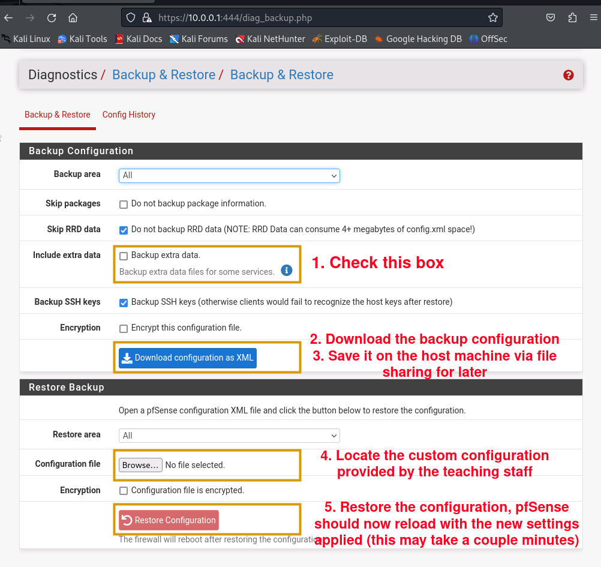

Cloud and Network Security Lab 2: Network Security 2
====

Responsible person/main contact: Asad Hasan & Lauri Suutari

## Preliminary tasks & prerequisites

This lab is continuation of week 1 network security theme. 

A basic understanding of networking is required. GitHub is required to complete this exercise

Make yourself familiar with following:


* **Port Forwards** - [Port forwards with NAT on pfSense](https://docs.netgate.com/pfsense/en/latest/nat/port-forwards.html)
* **NAT** - NAT guide on zenarmor about pfsense [here](https://www.zenarmor.com/docs/network-security-tutorials/pfsense-network-address-translation-nat-guide)
* **Sharing files between KVM and host machine** - [Guide to creating a mounting point for file share](https://www.debugpoint.com/share-folder-virt-manager/)


Useful resources from previous lab:

* **terraform** - Basic tutorial about what is terraform [here](https://k21academy.com/terraform-iac/terraform-beginners-guide/)
* **pfSense** - Official documentation of pfSense [here](https://docs.netgate.com/pfsense/en/latest/install/assign-interfaces.html)
* **wireshark** - Covered in pre-requisite courses. Official documentation [here](https://www.wireshark.org/docs/wsug_html/)


If you feel like your networking knowledge needs a revision, go through these tutorials:
[Basic tutorial 1](https://www.hackers-arise.com/post/networking-basics-for-hackers-part-1)
[Basic tutorial 2](https://www.hackers-arise.com/post/networking-basics-for-hackers-part-2)

Further reading about [networking concepts](https://docs.netgate.com/pfsense/en/latest/network/index.html)

## Grading

<!-- <details><summary>Details</summary> -->

Task #|Points|Description|Tools
-----|:---:|-----------|-----
Task 0 | - | Setting up new network | Terraform, virtual manager
Task 1 | 1 | Launch DDoS Attack on server and study traffic | Snort, wireshark, pfSense, DDoS-Attacker, Xdos-server
Task 2 | 3 | Fix security misconfigurations | pfSense,
Task 3 | 4 | VPN setup and configuration for remote access | pfsense, OpenVPN, wireguard
Task 4 | 5 | Your own experiment | Open-ended


Total points accumulated by doing the exercises reflect the overall grade. You can acquire up to 5 points per whole exercise.
<!-- </details> -->

---


## About the lab

* This document contains task descriptions and theory for the second network security lab. If there are any differences between the return template and this file, consider this to be the up-to-date document.
* **You are encouraged to use your own computer or virtual machine if you want.** This lab uses software and dependencies installed in previous lab. Check the Task 1 "**Setup Installation**" for information on what you need to install from [Lab 1's manual](https://github.com/ouspg/CloudAndNetworkSecurity/tree/main/1.%20Network%20Security) if you haven't . This lab has been made to be completed in a Linux environment and tested to work in debian, ubuntu and the provided Arch Linux virtual machine.
* __Upper scores for this assignment require that all previous tasks in this assignment have been done as well__, so e.g. in order to get the third point you will have to complete tasks 1, 2 & 3.
* Check the deadline from Moodle and __remember that you have to return your name (and possibly people you worked together with) and GitHub repository information to Moodle before the deadline.__


## Background

This week’s theme is continuation of network security.
Tasks are designed to be done with the provided network setup using [terraform](https://en.wikipedia.org/wiki/Terraform_(software)), see the [terraform commands tutorial](https://tecadmin.net/terraform-basic-commands/) for instructions on how to run the network using terraform. The firewall (+router) used in this network is [pfSense](https://docs.netgate.com/pfsense/en/latest/general/index.html).
The provided VM's within terraform has all the required tools preinstalled.  Contact course assistants if you require any extra tools, they'll install them in a custom image for you and provide instructions how to use it within the setup. 


## NEW NETWORK SETUP FOR THE SECOND LAB

For enhanced security purposes, the network setup for second lab has been upgraded and web-server has been exposed outside to the WAN. Network admins have moved the HTTP server to a new sub-network behind the pfsense firewall. This new sub-network is called [DMZ](https://en.wikipedia.org/wiki/Demilitarized_zone) and it only hosts the HTTP server. Original LAN network remains the same with kali linux. Here are the features of new network as described by network admins:

```
WAN Network Specifications (vtnet0):
The network operates on sub-net mask 255.255.255.0 (/24) with network address: 198.168.122.0
Provides internet access to LAN Network through pfsense


LAN Network Specifications (vtnet1):
Internal LAN Network. Internet enabled via WAN
The network operates on sub-net mask 255.255.255.0 (/24) with network address: 10.0.0.0

The IP address range for network is as follows:
Start address: 10.0.0.11 (/24)
End address: 10.0.0.100 (/24)

DHCP Server enabled: Yes
IPv6: No
Protocol for webGUI: HTTPS

DMZ (vtnet2):
The network operates on sub-net mask 255.255.255.0 (/24) with network address: 10.3.1.0
Restricted and isolated network.
Web-server hosted at 10.3.1.10 and accessible via LAN. Also accessible via WAN interface through port-forwarding

IMPORTANT NOTE: WebGUI can be accessed from LAN network with following URL: https://10.0.0.1:444

```

The new virtual test network is based on three networks:
1. WAN
2. LAN
3. DMZ

The WAN is your standard computer network. The LAN is the internal network which contains probe machine (kali) protected by pfSense firewall which also
acts as the default router for this. DMZ is the network which contains HTTP server (Ubuntu) and web-service is accessible via WAN through [port-forwarding](https://www.wundertech.net/pfsense-port-forwarding-setup-guide). 

In this lab, students will dive into this virtual setup and play-around to find things out and perform security tasks.


**See the official network diagram as provided by network admins**


---

## Task 0

### Setting up new network structure

Before, you can start doing the lab tasks for points, you need to spawn your virtual network infrastructure. For this, you require latest terraform configurations and pfsense image
containing new network. This is done for you already. All you have to do is clone the right terraform configurations and place the right VM images. Afterwards, you can initialize terraform as was in the first lab

For simplicity, follow the three steps guide below:

**1) Fetch the new_network setup branch**

Fetch the lab2 branch and checkout to it.
```
git fetch origin lab2
git checkout lab2
```

**2) Download and place relevant images into _network_sec_platform/images_ folder**

There are images that you need to download and place into the following directory _**network_sec_platform/images**_

If you completed lab 1, you can use the same kali and ubuntu images and download only the latest pfsense image named _**pfsense_x.qcow2**_

Image name|Image size|Download Link
:-:|:-:|:-:
Kali linux | 14.6 gb | [kali download](https://a3s.fi/swift/v1/AUTH_d797295bcbc24cec98686c41a8e16ef5/CloudAndNetworkSecurity/kali-linux-2023.4-qemu-amd64.zip)
Ubuntu server | 1.8 gb | [server download](https://a3s.fi/swift/v1/AUTH_d797295bcbc24cec98686c41a8e16ef5/CloudAndNetworkSecurity/ubuntu_server.qcow2)
pfSense (lab 2) | 1 gb | [pfsense download](https://a3s.fi/swift/v1/AUTH_d797295bcbc24cec98686c41a8e16ef5/CloudAndNetworkSecurity/pfsense_x.qcow2)

**3) Spawn your network**

Go-to network_sec_platform directory and use following commands to spawn the network

```
terraform init
terraform validate
terraform apply
```
If done correctly, there should be 12 resources spawned.

```
#Access virtual resources by typing
virt-manager
```
See machine's login info below 

Machine|username|password
-----|:---:|-----------
Kali| kali| kali
Ubuntu | ubuntu | linux
pfsense web-GUI | admin | pfsense

---

## Task 1

### Launch DDoS Attack on server and study traffic

In today's interconnected digital landscape, Distributed Denial of Service [DDoS](https://minhcung.me/simulate-a-denial-of-service-attack-bd8d4c834002) attacks have emerged as a prevalent threat, capable of disrupting online services, causing financial losses, and tarnishing reputations. This section of the lab manual aims to provide insights to DDoS attacks, exploring their mechanisms, impacts, and mitigation. 

In this task, students will launch a DDoS attack on the server hosted in DMZ from outside (WAN) and study about skills necessary to defend against these disruptive assaults in real-world scenarios.


### A) Access web-GUI and install snort

Access virtual machines and open the web-GUI through LAN network's kali linux. At this point, you are encouraged to explore your network and note down your VMs IP addresses. 

Using pfSense web-GUI package manager, install [snort](https://www.snort.org/) 

**Access snort package manager and provide screenshot. What is snort?**

### B) Launch DDoS attack and monitor snort log entries

Launch a DDoS attack on the server hosted in DMZ from outside (WAN) and study Snort log entries.

Use following two tools turn-by-turn to perform a DDoS attack:
1. [DDoS-Attacker](https://github.com/CruelDev69/DDoS-Attacker)
2. [Xdos-server](https://github.com/Whomrx666/Xdos-server)

**Provide command used to launch DDoS attack using DDoS-Attacker**

**What does snort log entries show?**

**Repeat the attack with XDos-server tool. What do you notice in snort log entries now?**

### C) Firewall state table inspection

State tables (read more about them [here](https://docs.trellix.com/bundle/endpoint-security-10.6.0-firewall-product-guide-windows/page/GUID-9023959B-AA8A-43D4-83ED-FF6388BC3A5A.html)) and entries play a crucial role in various networking devices and protocols, facilitating efficient packet processing and decision-making. 

In this task, you will explore how states entries are populated in pfsense. This will help you assess the route packets take to reach HTTP service on DMZ

To complete this task, do the following:
1) Launch DDoS attack from your host machine using any of the tools provided
2) Access the web-GUI
3) Head over to 'States' section under 'Diagnostics' tab and apply 'Interface=WAN' filter to see states originated from WAN


Study states populated and answer the following two questions

**TCP packets originated from <ip_addr1> and destined for <ip_addr_2>. However, as per state table inspection their final destination is 10.3.1.10 (which is internal IP). What is happening here. What is this technique called that's applied here by firewall?**

**Can state table be overflowed? What happens when they overflow?**

---
## Task 2

### Cyberattack recovery

[Incident response](https://www.ibm.com/topics/incident-response) is an important part of blue team side of cybersecurity. This is guided by the organizations [Incident Response Plan](https://www.cisa.gov/sites/default/files/publications/Incident-Response-Plan-Basics_508c.pdf) (IRP) which is maintained by a computer security incident team (CSIRT) and includes the roles and responsibilities of IRP team members, business continuity plan in case of breach, summary of software and tools that are in place, list of critical network and data recovery processes and the guidelines for communication. The goal of this set of processes is to mitigate and prevent the effects before, during and after potential incidents. Security incidents can be described as any kind of breach that puts the organization's Confidentiality, Integrity or availability at risk.

This section focuses on investigating, remediating and responding to the effects of a cyberattack that has compromised the internal network of your organization.

For this task you need to [enable file sharing between the KVM and the host system](https://www.debugpoint.com/share-folder-virt-manager/), and use the Diagnostics/Backup & Restore Backup option with the file provided at [pfsense_backup_file_location](https://a3s.fi/swift/v1/AUTH_d797295bcbc24cec98686c41a8e16ef5/CloudAndNetworkSecurity/final_misconf_pfsense.xml). This file contains the firewall misconfigurations that you are investigating in this task. Remember to backup your current configuration from the Backup Configuration tab by checking "Include extra data" and "Download configuration as XML", then saving this file in your host machine for future use.


 
 
### A) Identify and fix the firewall misconfigurations
In this task you focus on investigating, responding and remediating the effects of a cyberattack on the network system.

Figure out what changes have been done to the firewall configuration, this includes different sections of the pfSense WebGUI such as:
- Interface configurations
- Firewall NAT & Rules
- User Manager
- System
- Status / System Logs

Provide brief descriptions and images of these changes and what they affect in the network system.
Particularly investigate the following and explain the changes related to them:
- WAN exposure
- connection between internal network and the DMZ
- SSH settings and who has been able to SSH into the pfSense system (root & admins should be the only ones with permissions for this)

Tip: pfSense keeps logs of certain things

Your main objective is to restore access from the Kali machine to the webserver and to remove other changes in the firewall to bring the network back into a safe state.


### B) Finding the root cause and mitigating it
After investigating and analyzing the changes in the previous task, you should realize that there are suspicious account(s) associated in the pfSense that have excessive permissions. In the older versions of pfSense there were vulnerabilities that allowed certain things to happen to get root access if the WebGUI admin was logged in during the attack with the help of social engineering.

Figure out what cybersecurity vulnerability was used to gain these rights, how the vulnerability can be used to gain these rights and seek to provide an explanation of how and why this vulnerability was effective, which versions of pfSense does it affect and how it was fixed in the later versions of pfSense. One file relevant to this vulnerability has been reverted to a previous version of pfSense that contains a flag as a hint for what vulnerability this was.

Note: Although the pfSense version currently used in the KVM is 2.7.2, in this scenario you can assume the vulnerability is related to version 2.7.0.


After completing this task, you can revert back to the old configurations with the same method as before, but with the configuration you saved or redeploy the system with Terraform.


---


## Task 3

### VPN setup and configuration for remote access

Virtual Private Networks [VPNs](https://en.wikipedia.org/wiki/Virtual_private_network) have become a core feature of establishing secure connections between devices/networks enabling remote users to connect to companies internal networks using encryption and other methodologies to authenticate the user. Most IT companies today use these kinds of approaches for remote connections to their internal networks.


### A) Research and describe how VPNs work

Research how VPNs work and briefly describe how they establish a connection between two devices/networks and how the three most widely used VPN services differ from each other (max 200 words);
- Personal VPN services
- Remote access VPN
- Site-to-site VPN


### B) Setup and Configure OpenVPN to allow remote access from external network to the internal network

Your task as a cyber security professional is to set up a OpenVPN server to authenticate access to your organization's internal network(s) for users connecting from external networks. The internal company network in this situation consists of the DMZ- and the LAN networks. 

The organization that you are setting up the VPN for is named after the first two letters of your first name and surname i.e. if your name was Pekka Pouta, it would be PePo, the organization is based in Oulu, Finland, Pohjois-Pohjanmaa. Take this information into account when creating the certificates for OpenVPN.

If you configure and setup the OpenVPN client and server correctly, you should be able to login via the OpenVPN client and be able to access the machines hosted in the company network. 

Create and document your process of setting up and configuring a OpenVPN VPN solution to access the machines in the internal- and DMZ networks. Provide images of at least the following:

1. Server creation certificates (with organizational information visible)
2. OpenVPN WAN rules
3. OpenVPN Tunnel settings
4. OpenVPN Client connection establishment
5. Successful connection from remote network (host machine) to the internal networks (a ping to the kali machine and a curl to the web server in the DMZ suffice)

**You have two options for this task:** 
1. Use the OpenVPN installing wizard for the initial setup process and document thoroughly what is happening under the hood when you are creating the VPN connection. In addition to the above, this option focuses more on your understanding and documentation of the process. 
2. Manually create all the required interface/firewall rules and provide images of this process. This option focuses more on you're technical solutions.


### C) What type of tunnel did you create for the VPN connection?

Briefly explain what kind of tunnel you created for the VPN connection and explain what are the differences between split-tunnel & full-tunnel VPN connections.


---

## Task 4

### Open-ended task for highest grade. Secure the given network


This is a free-form task where you will play around with the given network structure and make it more secure. You can install any packages, modify any rules and even play around with network assignments.

Would you like to try installing different types of software for better security on this network. How does it fit the given network? How does it improve the security of existing system?

Would you like to add new firewall rules? What rules will you add? Do you think you need to change network configurations? 

Are there any existing rules that could be changed to enhance the security of the system? Could the system be setup differently with more security?

Couple of useful documents for reference:

[pfSense Software Network Address Translation Guide](https://www.zenarmor.com/docs/network-security-tutorials/pfsense-network-address-translation-nat-guide)

[How to Host a Single Website Behind a pfSense Firewall](https://www.contradodigital.com/2021/02/19/how-to-host-a-single-website-behind-a-pfsense-firewall/)

If you go through these reference documents, you'll have a deeper understanding of how the existing network was setup and may also come across ideas to improve it.

**Decide yourself what you are going to do and write a brief report on it**

**Document your work properly for this task and include necessary screenshots and commands used**

**You should state clearly your PLAN, which changes and addition to rules and configurations you made. Justify with screenshots**

**Make sure to include testing results to showcase success or failure**

**In case of partial implementation, write a brief report on issues and roadblocks encountered. You can still earn some points with failed attempts**


---

