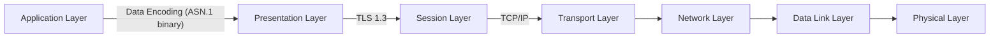

Cloud and Network Security Lab 3: Network Protocols
====

Responsible person/main contact: Niklas Saari, Asad Hasan & Lauri Suutari

## Preliminary tasks & prerequisites

This is the third lab in the series with the theme of Network Protocols. 
You should return the tasks to GitHub.

Make yourself familiar with the following topics:


* **List of networking protocols** - Read about the list of networking protocols for the OSI model on [Wikipedia](https://en.wikipedia.org/wiki/List_of_network_protocols_(OSI_model))
* **20 common networking protocols** - Article presenting 20 common networking protocols [here](https://medium.com/@rajeshmamuddu/20-different-network-protocols-commonly-used-in-networking-e98cab90d18d)
* **OSI Model** - What is the OSI Model on [Wikipedia](https://en.wikipedia.org/wiki/OSI_model)
* Especially, [Transport Layer Security](https://en.wikipedia.org/wiki/Transport_Layer_Security) is the topic of this week!

TLS protocol from a cryptographic perspective is handled in more depth in cryptographic systems and weakness - course.
This time we note the challenges of the practical implementation, which might not be related to cryptography itself.


## Grading

<!-- <details><summary>Details</summary> -->

You are **not required** to do the tasks in order, but if you skip the second task, you need to do the third one differently.

Task #|Points|Description|Tools
-----|:---:|-----------|-----
Task 1 | 1 | HTTP request smuggling | TBD
Task 2 | 6 | Implementing TLS 1.3 client from scratch | Rust or programming language of your choice, libFuzzer, libAFL
Task 3 | 1 | Fuzz testing exising TLS library (alternative to task 2 with less points) | ...
Task 4 | 1 | TLS certificate validation | TBD


Total points accumulated by doing the exercises reflect the overall grade. You can acquire up to 5 points from the whole exercise.
<!-- </details> -->

---


## About the lab

* This document contains task descriptions and theory for the third cloud and network security lab. If there are any differences between the return template and this file, consider this to be the up-to-date document.
* **You are encouraged to use your own computer or virtual machine if you want.** TODO ----------------------- TODO
* Check the deadline from Moodle and __remember that you have to return your name (and possibly people you worked together with) and GitHub repository information to Moodle before the deadline.__


## Background

This week’s theme is networking protocols.

Tasks are designed to be done using the course's provided virtual machine. **TODO**

Networking protocols are a set of rules and conventions that govern the communication between devices in a computer network. These protocols define how data is formatted, transmitted, received, and interpreted across the network. They facilitate the exchange of information between devices, ensuring compatibility and interoperability.

Key aspects of networking protocols include:

1) Addressing: Protocols define how devices are identified and addressed on the network. This includes assigning unique addresses, such as IP addresses, to devices to enable communication.

2) Routing: Protocols determine how data packets are routed from a source to a destination across the network. This involves selecting the best path for data transmission and managing network congestion.

3) Error Handling: Protocols include mechanisms for detecting and correcting errors that may occur during data transmission. This ensures reliable communication between devices.

4) Security: Many protocols incorporate security features to protect data from unauthorized access, interception, or tampering. This includes encryption, authentication, and access control mechanisms.

Some common examples of networking protcols include: Internet Protocol (IP), Transmission Control Protocol (TCP) and Hypertext Transfer Protocol (HTTP).


---

## Task 1

### HTTP request smuggling

Before, you can start doing the lab tasks for points, you need to spawn your virtual network infrastructure. For this, you require latest terraform configurations and pfsense image
containing new network. This is done for you already. All you have to do is clone the right terraform configurations and place the right VM images. Afterwards, you can initialize terraform as was in the first lab

For simplicity, follow the three steps guide below:

**1) Fetch the new_network setup branch**

Fetch the lab2 branch and checkout to it.
```
git fetch origin lab2
git checkout lab2
```

**2) Download and place relevant images into _network_sec_platform/images_ folder**

There are images that you need to download and place into the following directory _**network_sec_platform/images**_

If you completed lab 1, you can use the same kali and ubuntu images and download only the latest pfsense image named _**pfsense_x.qcow2**_

Image name|Image size|Download Link
:-:|:-:|:-:
Kali linux | 14.6 gb | [kali download](https://a3s.fi/swift/v1/AUTH_d797295bcbc24cec98686c41a8e16ef5/CloudAndNetworkSecurity/kali-linux-2023.4-qemu-amd64.zip)
Ubuntu server | 1.8 gb | [server download](https://a3s.fi/swift/v1/AUTH_d797295bcbc24cec98686c41a8e16ef5/CloudAndNetworkSecurity/ubuntu_server.qcow2)
pfSense (lab 2) | 1 gb | [pfsense download](https://a3s.fi/swift/v1/AUTH_d797295bcbc24cec98686c41a8e16ef5/CloudAndNetworkSecurity/pfsense_x.qcow2)

**3) Spawn your network**

Go-to network_sec_platform directory and use following commands to spawn the network

```
terraform init
terraform validate
terraform apply
```
If done correctly, there should be 12 resources spawned.

```
#Access virtual resources by typing
virt-manager
```
See machine's login info below 

Machine|username|password
-----|:---:|-----------
Kali| kali| kali
Ubuntu | ubuntu | linux
pfsense web-GUI | admin | pfsense

---

## Task 2: Implementing TLS 1.3 client from scratch (up to 6 points)

> [!Note]
> You can complete this task in pairs! **But not in larger groups**.

> You can fully focus on this task to get up to 6 points by doing it carefully.

> If you want to skip the coding, you can fuzz test existing TLS library and get up to 1 points.


Implementing network protocols correctly can be *hard*. They are typically complex and work in a binary, non-text format.
This is because of the performance reasons, error correction and the minimized addition of overhead to the total bandwidth usage. They must follow strict standards to be compatible with different hardware and software systems.
Protocols must be designed to handle arbitrary data and then parse and process them correctly while doing it fast. They must be fault-tolerant if they encounter incorrect data.

If we look at the network OSI model structure, we can see many different protocols on different layers for different purposes. 
In the following example graph, the application is transmitting ASN.1 binary encoded data as TLS 1.3 encrypted over TCP/IP protocol. 



All of the protocols are complex, but they share similar efficiency and robustness requirements while having different goals. 
 
 * ASN.1 encodes the application-specific data compactly to be suitable for the usage and parsing of other applications. (Compare it to more efficient  JSON)
 * TLS 1.3. encrypts the session data so that it cannot be eavesdropped on or modified, while also giving sufficient guarantees that the data goes to the intended party.
 * TCP/IP carries the data to the destination over some network in an IP address space with some reliability guarantees.


To demonstrate the complexity and process of doing them correctly and *maybe even more securely*, we will implement the handshake part of the TLS 1.3 protocol standard as a minimal client.

This should also make you more familiar with what it takes to transmit encrypted data over an insecure line so that it might even go to the correct destination, efficiently with binary protocols.

### TLS 1.3 Handshake Protocol

* [RFC 8446](https://datatracker.ietf.org/doc/html/rfc8446)
    * Provided ASN.1 notations about data structures are super useful when implementing the client. Especially, if one consults a friendly LLM. The Rust starter project has already most of them.
    * You *will need to* read this standard to understand the protocol.

* Transport Layer Security [in Wikipedia](https://en.wikipedia.org/wiki/Transport_Layer_Security)


A small background [blog](https://blog.cloudflare.com/rfc-8446-aka-tls-1-3) about the major changes compared to previous versions.

In conclusion, TLS 1.3 is much simpler compared to previous versions and supports only a limited amount of cipher suites (only the strong ones).

For the purpose of this task, it should be doable, and can give us a glance at what protocols could be!


Your main guide source should be [https://tls13.xargs.org](https://tls13.xargs.org), (but still, don't just copy the code from their GitHub).

During the handshake, both the client and server agree on the cipher suite as follows.

* Key exchange mechanism (e.g., ECDHE for elliptic curve Diffie-Hellman ephemeral)
* Signature algorithm (e.g., RSA, ECDSA)
* Symmetric encryption algorithm (e.g., AES-GCM, ChaCha20-Poly1305)
* The hash function for message authentication and PRFs (e.g., SHA-256)

The overall cipher suite is pre-defined for the task.

### Implementation requirements

> [!Important]
> You should implement *a client*, with minimal working features to complete TLS 1.3 handshake, while also noting the error handling. Or more, if you decide so, to replace other tasks from this week.

Minimal TLS client implementation includes the completion of the handshake process with following features:
  * Key exchange with X25519 and signatures with EdDSA (Elliptic Curve Diffie-Hellman key exchange using Curve25519 and Edwards-Curve Digital Signature Algorithm based on the same curve)
  * ChaCha20-Poly1305 as a symmetric algorithm
  * The client should be able to handle the processing of arbitrary input data from the TCP stream
  *  In TLS 1.3, the use of certain extensions is mandatory
  * Mandatory extensions as specified [here.](https://datatracker.ietf.org/doc/html/rfc8446#section-9.2)  (Supported Groups, Extension - Signature Algorithms, Extension - Supported Versions Extension - Key Share ?)
  * At least `github.com` supports the above ciphers

Note that the protocol follows mostly the *tag-length-data* principle. 
There can be constraints for the size of the tag or length, and **this defines how many bytes the tag or length can take**, while the length itself then defines the amount of subsequent bytes.

Additional requirements: 
 * Proper client-side certificate validation (replace the additional certificate validation task with this) (1p)

**One extra point** on showcasing the decrypted TLS 1.3 data from the server that supports this client.


> You are alloved to consult a friendly LLM, but note that the code it provides might not be correct and can include bugs! You are not allowed to directly copy-paste some existing implementation, even though the LLM is likely providing code samples based on those.


You must implement it with a strongly typed programming language of your choice.

Generally, if you want to do something efficiently, you should pick a lower-level programming language.
Typically, this has meant either the use of C or C++.
However, with great power comes a great responsibility and the history is filled with memory safety issues. Correct programming is hard and making difficult protocols makes it even harder. 

**You will get one bonus point for doing the work with *Rust*; this encourages the usage of memory-safe language, which can produce native performance and it enforces other design choices that could reduce the bugs in the software.**

> [!Note]
> *If you end up fighting with the Rust compiler, you are just preventing bugs, which would have resulted into software runtime with another programming language!*

Overall grading table for this task:

Description |Points|
-----|:---:|
Use of Rust with sufficient implementation | 1 |
Minimal handshake implementation from above | 2 |
Fuzz testing the implementation with the help of fuzzing libraries | 1 |
Proper client-side certificate validation | 1 |
Decrypt content from TLS 1.3 server with your client | 1 |


### Language list that you should consider

1. Rust (1 bonus point from sufficient implementation, and we offer [a starter project](rust_example).)
2. Other strongly typed memory-safe languages (typically less efficient because of the dynamic memory management) (Swift ([ARC-based](https://en.wikipedia.org/wiki/Automatic_Reference_Counting)), Go, Java, C#, etc.)
3. Programming C++ with [modern features](https://learn.microsoft.com/en-us/cpp/cpp/welcome-back-to-cpp-modern-cpp?view=msvc-170) (Unique pointers etc.), [Zig](https://ziglang.org/), or other native languages with some memory safety properties. High performance and control-level with some risk of memory issues.
4. Weakly typed scripting languages (Python, Ruby, PHP, JavaScript) or risky languages, C, basic C++, and Assembly, **are not allowed this time**. While the scripting languages can provide memory-safe code, they are typically inefficient, and increase the likelihood of other bugs as a result of weak types. 


For Rust, check [the starter project](rust_example).

If you decide to use C++, **you must use modern pointers**. We don't like memory bugs.
The use of modern pointers does not guarantee it, but they reduce them significantly.
They apply a similar ownership principle as the Rust does for every data object by default.

### Software dependency requirements

You are allowed to use dependencies other than the programming language's standard library as follows if they are not included in the standard library:
 * To generate cryptographically secure random bits. (e.g. [rand](https://docs.rs/rand/latest/rand/) crate in Rust)
 * To derive the public key from the private key in X25519 protocol (e.g. [curve25519-dalek ](https://github.com/dalek-cryptography/curve25519-dalek/tree/main/x25519-dalek) crate in Rust) and calculate the shared secret.
 * For parsing the certificates (typically means ASN.1 DER encoding). 
 * For ChaCha20-Poly1305 encryption and EdDSA signatures

 Other dependencies **are not allowed**.

 ### Notes 

 Consider HelloRetryRequest


 ## Task 3) Alternative

 Fuzztesting existing TLS libraries.

 Pick one of the following, or something else.

 - BoringSSL: a fork of OpenSSL for Chrome/Chromium and Android as well as other Google applications.
- Botan: a BSD-licensed cryptographic library written in C++.
- BSAFE Micro Edition Suite: a multi-platform implementation of TLS written in C using a FIPS-validated cryptographic module.
- BSAFE SSL-J: a TLS library providing both a proprietary API and JSSE API, using FIPS-validated cryptographic module.
- cryptlib: a portable open source cryptography library (includes TLS/SSL implementation).
- Delphi programmers may use a library called Indy which utilizes OpenSSL or alternatively ICS which supports TLS 1.3 now.
- GnuTLS: a free implementation (LGPL licensed).
- Java Secure Socket Extension (JSSE): the Java API and provider implementation (named SunJSSE).
- LibreSSL: a fork of OpenSSL by OpenBSD project.
- MatrixSSL: a dual licensed implementation.
- Mbed TLS (previously PolarSSL): A tiny SSL library implementation for embedded devices that is designed for ease of use.
- Network Security Services: FIPS 140 validated open source library.
- OpenSSL: a free implementation (BSD license with some extensions).
- Schannel: an implementation of SSL and TLS Microsoft Windows as part of its package.
- Secure Transport: an implementation of SSL and TLS used in OS X and iOS as part of their packages.
- wolfSSL (previously CyaSSL): Embedded SSL/TLS Library with a strong focus on speed and size.

Above list is from Wikipedia.
