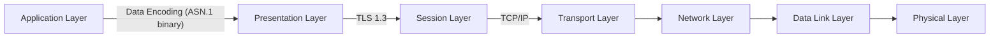
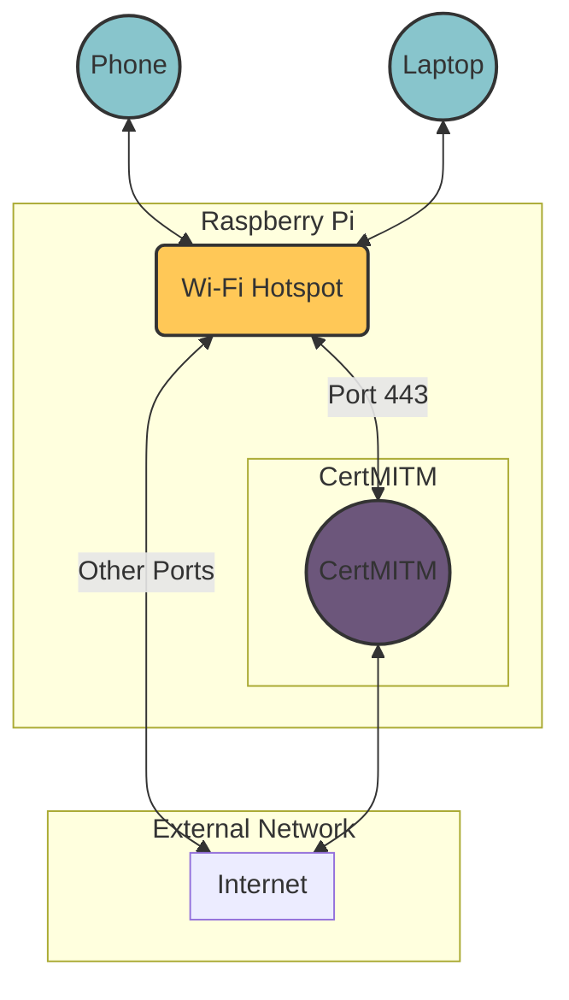

Cloud and Network Security Lab 3: Network Protocols
====

Responsible person/main contact: Niklas Saari, Asad Hasan & Lauri Suutari

## Preliminary tasks & prerequisites

This is the third lab in the series with the theme of Network Protocols. 
You should return the tasks to GitHub.

Make yourself familiar with the following topics:


* **List of networking protocols** - Read about the list of networking protocols for the OSI model on [Wikipedia](https://en.wikipedia.org/wiki/List_of_network_protocols_(OSI_model))
* **20 common networking protocols** - Article presenting 20 common networking protocols [here](https://medium.com/@rajeshmamuddu/20-different-network-protocols-commonly-used-in-networking-e98cab90d18d)
* **OSI Model** - What is the OSI Model on [Wikipedia](https://en.wikipedia.org/wiki/OSI_model)
* **curl** - Useful curl tutorial [here](https://blog.hubspot.com/website/curl-command)
* **netcat** - Introductory netcat [tutorial](https://www.geeksforgeeks.org/introduction-to-netcat/)
* Especially, [Transport Layer Security](https://en.wikipedia.org/wiki/Transport_Layer_Security) is the topic of this week!

TLS protocol from a cryptographic perspective is handled in more depth in cryptographic systems and weakness - course.
This time we note the challenges of the practical implementation, which might not be related to cryptography itself.


## Grading

<!-- <details><summary>Details</summary> -->

You are **not required** to do the tasks in order, but if you do the second task, you shouldn't do the task 3 or 4.

As a result, there are two different paths to do the exercises this week.
 * In both cases, you can do the task 1, and then
    * Do task 2 completely and ignore the rest. With very good implementation you might get even more than 9 points.
    *This task will give the most points on the course and can compensate for other weeks*.
    * Or, do the tasks 3 and 4, but not that many points are available. Task 2 covers also the topics of tasks 3 and 4.


Task #|Points|Description|Tools
-----|:---:|-----------|-----
Task 1 | 1 | HTTP request smuggling | Wireshark, curl, docker-compose, netcat
Task 2 | 9 | Implementing TLS 1.3 client from scratch | Rust or programming language of your choice, Wireshark, libFuzzer, libAFL
Task 3 | 1 | Fuzz testing exising network protocol (TLS library, Wireshark) (alternative to task 2 with less points) | AFL++, radamsa, other fuzzing tools
Task 4 | 2 | TLS certificate validation | certmitm


Total points accumulated by doing the exercises reflect the overall grade. You can acquire up to 10 points from the whole exercise (Combination of Task 1 and Task 2).
<!-- </details> -->

---


## About the lab

* **You are encouraged to use your own computer or virtual machine if you want.** However, the use of a Linux machine is necessary. 
* Check the deadline from Moodle and __remember that you have to return your name (and possibly people you worked together with) and GitHub repository information to Moodle before the deadline.__


## Background

This week’s theme is networking protocols.

Networking protocols are a set of rules and conventions that govern the communication between devices in a computer network. These protocols define how data is formatted, transmitted, received, and interpreted across the network. They facilitate the exchange of information between devices, ensuring compatibility and interoperability.

Key aspects of networking protocols include:

1) Addressing: Protocols define how devices are identified and addressed on the network. This includes assigning unique addresses, such as IP addresses, to devices to enable communication.

2) Routing: Protocols determine how data packets are routed from a source to a destination across the network. This involves selecting the best path for data transmission and managing network congestion.

3) Error Handling: Protocols include mechanisms for detecting and correcting errors that may occur during data transmission. This ensures reliable communication between devices.

4) Security: Many protocols incorporate security features to protect data from unauthorized access, interception, or tampering. This includes encryption, authentication, and access control mechanisms.

Some common examples of networking protocols include; Internet Protocol (IP), Transmission Control Protocol (TCP) and Hypertext Transfer Protocol (HTTP).


---

## Task 1

### HTTP request smuggling

HTTP Request Smuggling is a technique used to manipulate the interpretation of HTTP requests by exploiting inconsistencies in the way front-end and back-end servers or proxies handle requests. By carefully crafting malicious requests, an attacker can cause the front-end and back-end servers to interpret the request differently, leading to various security vulnerabilities such as cache poisoning, session fixation, and bypassing security controls. Read more about this technique on [Port Swigger](https://portswigger.net/web-security/request-smuggling)


### A) How do HTTP request smuggling vulnerabilities arise? What's the difference between CL.TE, TE.CL, and TE.TE techniques 

Your first task is to study HTTP request smuggling and write a detailed paragraph about how HTTP request smuggling vulnerabilities arise and the differences between CL.TE, TE.CL, and TE.TE HTTP requests smuggling techniques. Furthermore, answer the following sub-question

**In which version of HTTP is this vulnerability present? Why is it present in this specific HTTP version? How is the mechanism different?**

Useful resources: 
1. [Seebug article](https://paper.seebug.org/1049/)
2. [Research article](https://www.hindawi.com/journals/scn/2022/3121177/)

### B) Setup webservers, access webpages and capture associated HTTP traffic using Wireshark

The exercise environment is based on the GitHub user ZeddYu's [HTTP Smuggling Lab 2.](https://github.com/ZeddYu/HTTP-Smuggling-Lab/tree/master/lab2)

Download the zip file from [here](https://a3s.fi/swift/v1/AUTH_d797295bcbc24cec98686c41a8e16ef5/CloudAndNetworkSecurity/http-website-lab3.zip)


You need Docker and Docker Compose. These are pre-installed for the course VM.

Extract the zip file, and in that directory, run `docker-compose up`.

For a Debian-based Linux, check the instructions below.


<details>

<summary>Debian installation instructions</summary>

```
### Instructions to setup web-server ###
# Install dependencies (docker & docker-compose)
sudo apt update
sudo apt install docker.io docker-compose

# Navigate to folder http-website-lab3/
# Use docker-compose up to run the webserver. Make sure you have docker and docker-compose installed
# Be paitent, first build can take 10-15 minutes for the process to complete 
docker-compose up
```
If you are having permission issues, check that your current user belongs to the `docker` group.

</details>


#### Check

```
# Run the provided check.sh shell script
chmod +x check.sh;./check.sh|grep HTTP
HTTP/1.1 200 OK
HTTP/1.1 200 OK
HTTP/1.1 200 OK
HTTP/1.1 200 OK

# 4 HTTP code 200 means your setup is working perfectly!
```

The setup uses a front-end reverse proxy server ([ATS](https://trafficserver.apache.org)) and two back-end servers called LNMP & LAMP to handle requests. Based on the internal domain name header sent as part of
HTTP packet or port number, ATS is able to distinguish between LNMP & LAMP requests and fetch appropriate resources.

We have 3 HTTP actors, each one on a local port:

    127.0.0.1:9010 : ATS 7.1.2 (internally listening on port 8080)
    127.0.0.1:9011 : LAMP (internally listening on port 80)
    127.0.0.1:9012 : LNMP (internally listening on port 80)

For example, to access HTTP actor LAMP, you would enter http://127.0.0.1:9011 in your browser

Figure below shows the architecture. 


As a next step, start Wireshark and set it to capture traffic on loopback interface. Run each HTTP actor and capture packets

**Add a screenshot of successfully accessing LAMP HTTP resource**

**Study HTTP packets registered when you access LAMP & LNMP resources. Copy/paste the contents of one such packet and explain what this packet is doing**

In the next part, you'll perform an actual HTTP request smuggling attack. For this, you need to understand the most important headers in the HTTP packet.


### C) Exploiting HTTP request smuggling vulnerability 

#### Information on the vulnerability

CVE states in [numerous announces](https://cve.mitre.org/cgi-bin/cvename.cgi?name=CVE-2024-23452) that the Apache HTTP server is vulnerable to HTTP request smuggling attacks. This can be verified by
going to the official [cve](https://cve.mitre.org/) website and search for the corresponding results.

In our current ATS 7.1.2 deployment, if a request causes a 400 error, the established TCP link will not be closed.

In the CVE announcement (2018-08-28), there were numerous impacted ATS versions (6.0.0 to 6.2.2 and 7.0.0 to 7.1.3) carrying this vulnerability.
In this task, we'll learn how to exploit this vulnerability using the HTTP smuggling technique.

Useful reference: [Section 4.3.2 Second Patch](https://paper.seebug.org/1049/#432-second-patch) on seebug paper

#### Generating two 400 responses

In-order to exploit the vulnerability 'if a request causes a 400 error, the established TCP link will not be closed', we can craft and send two requests. Technically, both should return
a 400 error response. However, with correct HTTP request smuggling a 400 response and a 200 response can also be captured in Wireshark (indicating a successful request smuggling attack)

To demonstrate this, use netcat to execute:

```
printf 'GET / HTTP/1.1\r\n'\
'Host: lnmp.com\r\n'\
'aa: \0GET /2333 HTTP/1.1\r\n'\
'Host: lnmp.com\r\n'\
'\r\n'\
| nc 127.0.0.1 9010

# OR THIS (OR ANY CUSTOM VARIATIONS) ALL WOULD RESULTS IN TWO 400 response

printf 'GET / HTTP/1.1\r\n'\
'Host: lnmp.com\r\n'\
'aa: \0GET / HTTP/1.1\r\n'\
'Host: lnmp.com\r\n'\
'\r\n'\
| nc 127.0.0.1 9010
```

**Demonstrate two 400 responses. Add screenshot**

>[!TIP]
> Netcat can be piped with prinf statement to send custom HTTP packets in raw form to the desired destination
>
> Curl can be used with flags -i and -X followed by request method and headers (+data) to send custom HTTP packets and see the output

### Exploiting the vulnerability

In the previous part, you get two 400 responses. However, with correct HTTP smuggling, you can make the second response 200 OK
and extract the html information from the back-end server. This is because in ATS 7.1.2 , if a request causes a 400 error, 
the established TCP link will not be closed which leaves a margin for careful HTTP smuggling request to extract 
important information and bypass the second request directly to the back-end. 

**Modify the netcat query provided above to successfully perform
the HTTP request smuggling attack and extract `lnmp.com` html body as the second response**

>[!Tip]
> When ATS parses a HTTP request, if it encounters NULL, it will cause a truncation operation. 
The one request we send is two requests for the ATS server. Therefore, both of them gets resolved.
> The first part is processed by ATS and the second part is forwarded to back-end.
> Specific name for this type of smuggling attack is called 'HTTP Request Splitting' and it falls under the category of HTTP request smuggling.

Return following:

**1. Screenshot of the 400 response followed by 200 response**

**2. Screenshot of the second request successfully extracting LNMP html body**

**3. Netcat command**

>[!Note]
> An alternate way to do this is by sending custom packets either through Burpsuite or curl command but they are not part of this tutorial.
> Correct solution using burpsuite or curl is also accepted but not recommended for beginners


---

## Task 2: Implementing TLS 1.3 client from scratch (up to 9 points)

> [!Note]
> You can complete this task in pairs! **But not in larger groups**. Remember to mention your pair. The workload assumes that you have friendly LLMs available, such as ChatGPT, [Phind](https://www.phind.com) or [GitHub Copilot](https://docs.github.com/en/copilot/quickstart). Especially GitHub Copilot is useful for this task, so this is a good chance to try it out.

> [!Note]
> You can work on this task until the end of the course, if you want to, but it is recommended to do in time.

> You can fully focus on this task to get up to 9 points by doing it carefully. But be warned, getting a maximum grade requires a lot of work. If you want to skip the coding, you have another path with similars goals on task 3 and task 4.


Implementing network protocols correctly can be *hard*. They are typically complex and work in a binary, non-text format.
This is because of the performance reasons, error correction and the minimized addition of overhead to the total bandwidth usage. They must follow strict standards to be compatible with different hardware and software systems.
Protocols must be designed to handle arbitrary data and then parse and process them correctly while doing it fast. They must be fault-tolerant if they encounter incorrect data.

> A huge part from the all security problems are related to faulty implementations of these protocols, or incorrect use of them.

If we look at the network OSI model structure, we can see many different protocols on different layers for different purposes. 
In the following example graph, the application is transmitting ASN.1 binary encoded data as TLS 1.3 encrypted over TCP/IP protocol. 



All of the protocols are complex, but they share similar efficiency and robustness requirements while having different goals. 
 
 * ASN.1 encodes the application-specific data compactly to be suitable for the usage and parsing of other applications. (Compare it to more efficient  JSON)
 * TLS 1.3. encrypts the session data so that it cannot be eavesdropped on or modified, while also giving sufficient guarantees that the data goes to the intended party.
 * TCP/IP carries the data to the destination over some network in an IP address space with some reliability guarantees.


To demonstrate the complexity and process of doing them correctly and *maybe even more securely*, we will implement the handshake part of the TLS 1.3 protocol standard as a minimal client.

This should also make you more familiar with what it takes to transmit encrypted data over an insecure line so that it might even go to the correct destination, efficiently with binary protocols.

> [!Important]
> **This is for educational purposes only. In general, you should not write your TLS library yourself on byte level.**

### TLS 1.3 Handshake Protocol

* [RFC 8446](https://datatracker.ietf.org/doc/html/rfc8446)
    * Provided ASN.1 notations about data structures are super useful when implementing the client. Especially, if one consults a friendly LLM. *The Rust Starter project has already most of them.*
    * You *will need to* read this standard to understand the protocol.

* Transport Layer Security [in Wikipedia](https://en.wikipedia.org/wiki/Transport_Layer_Security)


A small background [blog](https://blog.cloudflare.com/rfc-8446-aka-tls-1-3) about the major changes compared to previous versions.

In conclusion, TLS 1.3 is much simpler compared to previous versions and supports only a limited amount of cipher suites (only the strong ones).

For the purpose of this task, it should be doable, and can give us a glance at what protocols could be!

To get a good overview of the standard and the handshake process at the byte level, check [https://tls13.xargs.org](https://tls13.xargs.org).
[The provided Rust project](https://github.com/ouspg/tls13tutorial/) will help the implementation of other programming languages too, if you decide so. 

During the handshake, both the client and server agree on the cipher suite as follows.

* Key exchange mechanism (e.g., ECDHE for elliptic curve Diffie-Hellman ephemeral)
* Signature algorithm (e.g., RSA, ECDSA)
* Symmetric encryption algorithm (e.g., AES-GCM, ChaCha20-Poly1305)
* The hash function for message authentication and PRFs (e.g., SHA-256)

The priority and availability of the cipher suites are pre-defined for the task.

### Implementation requirements (4p)

> [!Important]
> You should implement *a client*, with minimal working features to complete TLS 1.3 handshake, while also noting the error handling. Or more, if you decide so, to replace other tasks from this week.

Minimal TLS client implementation includes the completion of the handshake process with the following features:
  * Key exchange with X25519 and signatures with EdDSA (Elliptic Curve Diffie-Hellman key exchange using Curve25519 and Edwards-Curve Digital Signature Algorithm based on the same curve).
  * ChaCha20-Poly1305 as a symmetric algorithm and cipher suite.
  *  In TLS 1.3, the use of certain extensions is mandatory
  * Mandatory extensions as specified [here.](https://datatracker.ietf.org/doc/html/rfc8446#section-9.2) The sample Rust project has most of them implemented with `as_bytes` mapper. You can also get a good overview of the extensions required by the client from the visualization of https://tls13.xargs.org. 
  * At least `cloudflare.com` and `google.com` support the above ciphers for testing purposes.
  * You can and *should* use Wireshark to debug your implementation.

Note that the protocol follows mostly the *tag-length-value* principle. 
There can be constraints for the size of the tag or length, and **this defines how many bytes the tag or length can take**, while the length itself then defines the number of subsequent bytes.

[The sample project](https://github.com/ouspg/tls13tutorial/) provides the *encoding* part for the above, but not the *decoding* part, other than a couple of partial examples. Decoding means mapping arbitrary binary data to correct data structures. This is the part where the typical security problems arise and you should focus on.

### Functional testing and fuzzing (2p+)

The client should be able to handle the processing of arbitrary input data from the TCP stream. We get some guarantees with fuzz testing which provides one additional point.

To ensure the validity of encoding the data structures and handling some typical error scenarios, you should add some functional testing for the project.

You are expected to integrate some fuzzing library into your project.
In the provided Rust project, there is a relevant documentation.

Some common libraries for fuzzing:
  * [libFuzzer](https://llvm.org/docs/LibFuzzer.html)
  * [LibAFL](https://github.com/AFLplusplus/LibAFL)
  
You can find bindings for above for different programming languages.

### Certificate validation (1p+)

> "The most dangerous code in the world: validating SSL certificates in non-browser
software." [Georgiev, Martin, et al.](https://dl.acm.org/doi/10.1145/2382196.2382204)

To make sure that you are messaging with the claimed entity, you need to validate certificates.

You can additionally do a proper client-side certificate validation to get an additional point. In practice, this means: 
  * Verify that the server-provided certificate is authentic and issued by a trusted entity (Certificate Authority, CA). Check the certificate chain.
  * Verify that this certificate belongs to the domain you are connecting to.
  * Verify that the certificate has not expired.
  * Verify that this certificate is not revoked. (OPTIONAL, can give additional points)


This will replace the final task.

### The decryption of the application data content (1p)

You can get **one point** for showcasing the decrypted TLS 1.3 application data from the server that supports this client.
To demonstrate this, you will send TLS 1.3 encrypted application data, for example to `cloudflare.com`. The application data contains an HTTP GET request to path `/robots.txt`.

```http
GET /robots.txt HTTP/1.1
Host: cloudflare.com
Connection: close
```


Typically, this means sending the following raw string as application data payload in the TLS record over TCP:

```text
GET /robots.txt HTTP/1.1\r\nHost: cloudflare.com\r\nConnection: close\r\n\r\n
```

The server will then send the data in response, wrapped in the TLS record again.


### Language list that you should consider

**You will get one bonus point for doing the work with *Rust*; this encourages the usage of memory-safe language, which can produce native performance and it enforces other design choices that could reduce the bugs in the software.**

> [!Note]
> *If you end up fighting with the Rust compiler, you are just preventing bugs, which would have resulted into software runtime with another programming language!*

Otherwise, you must implement it with a strongly typed programming language of your choice.
We hope that you do it with Rust and the provided [sample project](https://github.com/ouspg/tls13tutorial). It has many things done already and will introduce you to some modern tooling.

Generally, if you want to do something efficiently, you should pick a lower-level programming language.
Typically, this has meant either the use of C or C++.
However, with great power comes a great responsibility and the history is filled with memory safety issues. Correct programming is hard and making difficult protocols makes it even harder. 

1. Rust (1 bonus point from sufficient implementation, and we offer [a starter project](rust_example), with a lot of working functionality, to compensate for the initial difficulty of the language.)
2. Other strongly typed memory-safe languages (typically less efficient because of the dynamic memory management) (Swift ([ARC-based](https://en.wikipedia.org/wiki/Automatic_Reference_Counting)), Go, Java, C#, etc.)
3. Programming C++ with [modern features](https://learn.microsoft.com/en-us/cpp/cpp/welcome-back-to-cpp-modern-cpp?view=msvc-170) (Unique pointers etc.), [Zig](https://ziglang.org/), or other native languages with some memory safety properties. High performance and control level with some risk of memory issues.
4. Weakly typed scripting languages (Python, Ruby, PHP, JavaScript) or risky languages, C, basic C++, and Assembly, **are not allowed this time**. While the scripting languages can provide memory-safe code, they are typically inefficient, and increase the likelihood of other bugs as a result of weak types. 


If you decide to use C++, **you must use modern pointers**. We don't like memory bugs.
The use of modern pointers does not guarantee it, but they reduce them significantly.
They apply a similar ownership principle as the Rust does for every data object by default.

> You are alloved to consult a friendly LLM, but note that the code it provides might not be correct and can include bugs! You are not allowed to directly copy-paste some existing implementation, even though the LLM is likely providing code samples based on those.

### Software dependency requirements

You are allowed to use dependencies other than the programming language's standard library as follows if they are not included in the standard library:
 * To generate cryptographically secure random bits. (e.g. [rand](https://docs.rs/rand/latest/rand/) crate in Rust)
 * To derive the public key from the private key in X25519 protocol (e.g. [curve25519-dalek ](https://github.com/dalek-cryptography/curve25519-dalek/tree/main/x25519-dalek) crate in Rust) and calculate the shared secret.
 * For parsing the certificates (typically means ASN.1 DER encoding), e.g. [rasn](https://github.com/librasn/rasn) crate in Rust. 
 * To verify the certificate chain
 * For ChaCha20-Poly1305 encryption and EdDSA signatures (e.g. [ChaCha20Poly1305](https://github.com/RustCrypto/AEADs/tree/master/chacha20poly1305) and [ed25519-dalek](https://github.com/dalek-cryptography/curve25519-dalek/tree/main/ed25519-dalek) crates in Rust)
 * For key derivation (e.g. HKDF with SHA256)

 Other dependencies **are not allowed**.
 Especially, you are not allowed to use the existing byte-parsing libraries. The above is already included in the starter project.

### Debugging tips for the handshake protocol

You can use `openssl` to form a TLS connection with specific parameters.
This can help us to understand, what the correct process looks like, on top of the other material.
Let's say, we want to force TLS 1.3 version and get the handshake data. We can use the following command:

```bash
openssl s_client -connect github.com:443 -tls1_3 -ciphersuites TLS_CHACHA20_POLY1305_SHA256 -msg -tlsextdebug
```

However, not all the data is well segmented.
The content of `ClientHello` is a single hex dump, and that does not help us to see, for example, what extensions our client sets by default.

For that, Wireshark is very useful. It can format every byte from the TLS handshake protocol and can help us to get, for example, test data from known functioning TLS libraries, or **it can help us to understand what goes wrong with our own TLS implementation**.

Here is an example look for TLS 1.3 ClientHello structure for `github.com` in Wireshark:

```text
Frame 3130: 310 bytes on wire (2480 bits), 310 bytes captured (2480 bits) on interface en0, id 0
Ethernet II, Src: Apple_b6:f2:a5 (5c:e9:1e:b6:f2:a5), Dst: ASUSTekCOMPU_0c:7f:24 (2c:fd:a1:0c:7f:24)
Internet Protocol Version 4, Src: 192.168.1.146, Dst: 140.82.121.4
Transmission Control Protocol, Src Port: 62639, Dst Port: 443, Seq: 1, Ack: 1, Len: 244
Transport Layer Security
    TLSv1.3 Record Layer: Handshake Protocol: Client Hello
        Content Type: Handshake (22)
        Version: TLS 1.0 (0x0301)
        Length: 239
        Handshake Protocol: Client Hello
            Handshake Type: Client Hello (1)
            Length: 235
            Version: TLS 1.2 (0x0303)
            Random: 162b6eeae2555ea320e205eda9c5d5f6cbe17806a7b4922cbcf06bcb6a44d43b
            Session ID Length: 32
            Session ID: 648ae57da16d9b9891a3a03b423a35c55bd38ae7563bfe9ac40044f29870785e
            Cipher Suites Length: 2
            Cipher Suites (1 suite)
            Compression Methods Length: 1
            Compression Methods (1 method)
            Extensions Length: 160
            Extension: server_name (len=15) name=github.com
            Extension: ec_point_formats (len=4)
            Extension: supported_groups (len=22)
            Extension: session_ticket (len=0)
            Extension: encrypt_then_mac (len=0)
            Extension: extended_master_secret (len=0)
            Extension: signature_algorithms (len=36)
            Extension: supported_versions (len=3) TLS 1.3
            Extension: psk_key_exchange_modes (len=2)
            Extension: key_share (len=38) x25519
            [JA4: t13d011000_58070c528ac8_3eb3b556ea2c]
            [JA4_r: t13d011000_1303_000a,000b,000d,0016,0017,0023,002b,002d,0033_0403,0503,0603,0807,0808,081a,081b,081c,0809,080a,080b,0804,0805,0806,0401,0501,0601]
            [JA3 Fullstring: 771,4867,0-11-10-35-22-23-13-43-45-51,29-23-30-25-24-256-257-258-259-260,0-1-2]
            [JA3: 482d93134dde169bf71e5da09c7715a8]
```

Wireshark is capable of showing what specific part from the `ClientHello` structure was invalid.

### Overall grading table for this task

Be warned that grading is based on the Rust starter project.
It has already a lot of existing code, so in other programming languages, you probably need to do more work.

Description |Points|
-----|:---:|
Use of Rust with sufficient implementation | 1 |
Minimal handshake implementation from above | 4 |
Functional and fuzz testing the implementation with the help of fuzzing libraries | 2+ |
Proper client-side certificate validation | 1+ |
Decrypt application content from TLS 1.3 server with your client | 1 |

## Task 3: Fuzz testing existing network protocol library or parser (1p)

We assume that you have already fuzz-tested something on the previous courses or that you are familiar with the topic otherwise.
Some well-known CLI-oriented fuzzers:
  * [`AFLplusplus`](https://github.com/AFLplusplus/AFLplusplus)
  * [`radamsa`](https://gitlab.com/akihe/radamsa)
  * [`hongfuzz`](https://github.com/google/honggfuzz)
  * [`ffuf`](https://github.com/ffuf/ffuf)

You are free to test some network protocols in this task.

We recommend testing some of the existing TLS libraries. See a list for example from [Wikipedia](https://en.wikipedia.org/wiki/Transport_Layer_Security#Libraries).
Another interesting scenario would be to fuzz test some specific network protocol from Wireshark/tshark and see if it can parse them without crashing or other memory issues. 

Your task is the following:
 * Compile the code, with instrumentation if your fuzzer supports coverage-guided fuzzing.
 * Compile the code with [AddressSanitizer](https://clang.llvm.org/docs/AddressSanitizer.html) to make the program crash early when there are memory issues, if it is native code.
 * Fuzz test different interfaces. For example, you can try to fuzz test `openssl`'s certificate parsing and reading of public and private keys. 


Some fuzzing material is available [here.](https://github.com/secfigo/Awesome-Fuzzing)
You can use some of them as an example and reproduce their work. You can also look for the internet for other blog posts and try to reproduce their work, as long as it is related to network protocols.

If you want to go the deep end, check the fuzzing of the [TCP/IP stack](https://media.ccc.de/v/37c3-12235-fuzzing_the_tcp_ip_stack).

> Report the findings and process you had to do. You are not required to find something. However, try to test different input interfaces with fuzzing, or try to make the fuzzer to focus on specific part of the target by providing valid sample inputs.

---
## Task 4:  TLS certificate validation (up to 2 points)
> [!Note]
> If you completed the client-side implementation to a sufficient level in task 2, you do not need to complete this task to receive full credits for this weeks laboratory.
> Course staff provided certificate and key can be found from the [moodle](https://moodle.oulu.fi/mod/assign/view.php?id=1153869&forceview=1)

Certificate validation is an ongoing problem with TLS implementations, lots of libraries implement this, but the issue is that certificate validation is usually optional for the client in TLS and the configuration of certificate validation in different TLS libraries can be very difficult. When validating certificates, it should be checked who has issued the certificate, to whom is it issued to and that the certificate has been properly signed. Especially self signed certificates should not just be accepted without validation as these can be easily created on the go. A good example of improper certificate validations are [OpenSSL](https://www.openssl.org/) and [WolfSSL](https://www.wolfssl.com/) libraries where the validation isn't even enabled by default.

To complete this task you should understand how TLS works and how the certificates are (or aren't) validated on the server side. The following links contain sufficient information to get started with this task:
* [DEF CON 31 - certmitm Automatic Exploitation of TLS Certificate Validation Vulns - Aapo Oksman](https://www.youtube.com/watch?v=w_l2q_Gyqfo)
* [Presentation slides of certmitm](https://media.defcon.org/DEF%20CON%2031/DEF%20CON%2031%20presentations/Aapo%20Oksman%20-%20certmitm%20automatic%20exploitation%20of%20TLS%20certificate%20validation%20vulnerabilities.pdf)
* [certmitm demo](https://www.youtube.com/watch?v=h0HeTBfKLhQ)

### Local Certificate Validation (1p) 

You are free to use **tools of your choice** to complete this task, however we highly suggest getting started with Aapo Oksman's [certmitm](https://github.com/ouspg/certmitm_logging) ouspg branch.

You can use any machine for this task, but it is suggested to run it on a VM

> [!Warning]
> Although this isnt illegal as you are just finding out potential vulnerabilities, not exploiting them, you shouldn't test this on Riot Games applications. As per [Aapo Oksman's iOS demo](https://www.youtube.com/watch?v=bWidokJKuUc), their response to his vulnerability findings was "in theory it may be possible (to exploit this), but we would detect it and kick you or mark it as suspicious for investigation...this finding will not be fixed since there is compensathing controls.". 

The overall process should look like the following:
* Enable IPv4 forwarding:
```console
sudo sysctl -w net.ipv4.ip_forward=1
```
* Create a self-signed certificate and download the course provided certificate and move them to certmitm/real_certs/
* Create a second user
* Create an iptables rules to mark packets generated by the ID of second user:
```console
sudo iptables -t mangle -A OUTPUT -m owner --uid-owner <second user uid> -j MARK --set-mark 1
```
* Redirect TCP packets generated by others users destined to port 443 into port 9900
```console
sudo iptables -t nat -A OUTPUT -p tcp --dport 443 -m mark ! --mark 1 -j REDIRECT --to-port 9900
```
* Run certmitm on the second user
```
python3 certmitm.py --listen 9900 --workdir testing --verbose --log-output --show-data
```
* Switch to another user and install packages, run softwares, browse internet and analyze the results generated by certmitm, if you do manage to get red information from certmitm these could be potential vulnerabilities

If successful certmitm should start producing data like the following:


To get full credit for this task you need to test **installing atleast 5 new applications/packages, try out 5 internet connected applications, browse the internet and test native applications that should include TLS validation**. Provide the file created by certmitm in your github return repository under week 3 and answer the following questions thoroughly, we expect good detailed answers for full credit:
- Describe what certmitm is doing in this usecase scenario, the video above desribes it in defail
- Describe the data that is most commonly outputted by certmitm
- Did you find any interesting outputs, if so describe what could have caused them
- Did you find any critical vulnerabilities (example below), if so what caused them
- Provide the output files of your chosen tool under this weeks returnables in a directory named outputs (with the given tool the output files are in /certmitm/outputs/ path)


> [!Note]
> In situations where you dont seem to be able to install/run software the best thing you can do is retrying again!

### WLAN certificate Validation (1p)
On this task you will be provided a Raspberry Pi, and a SD card that has all the configurations set up to work as a Wi-Fi hotspot. The following video demonstrates this task:
* [Exploiting insecure Certificate Validation in iOS](https://www.youtube.com/watch?v=bWidokJKuUc)

To begin with you have 3 options:
1. Connect your Raspberry Pi into a monitor or
2. Connect another device to the same network or open SSH port on your router for connection to the device from another network, then ssh into the system by running `ssh ouspg@raspberrypi.local`, the password is `ouspg`.
3. Connect the Raspberry Pi to your laptop directly via ethernet cable, you can now ssh into the system by running `ssh ouspg@raspberrypi.local`, the password is `ouspg`.

>[!Note]
>If you are going with the 3rd option, you will need to enable internet connection sharing on the laptop to the ethernet that rasp is connected to and reboot the laptop for the raspberry to get an IP address and connection to the internet.
>**Third option is what will be used in the laboratory session**

After doing this you need to enable routing and set the built-in Wi-FI module to broadcast a hotspot network by executing the following command on the Raspberry Pi:
```console
sudo sysctl -w net.ipv4.ip_forward=1
```
You can set the built-in Wi-Fi module to broadcast a hotspot via the GUI by creating a new wireless hotspot:


If you want to do this on a Raspberry Pi 4, you should get a VNC viewer and connect to the raspberrypi.local from that software for remote GUI. [Guide for this](https://www.makeuseof.com/how-to-remotely-access-raspberry-pi-from-pc/)

Or by console via (You get the hotspot UUID via 'nmcli connection'):
```console
sudo nmcli device wifi hotspot ssid <hotspot name> password <hotspot password> ifname wlan0
sudo nmcli connection modify <hotspot UUID> connection.autoconnect yes connection.autoconnect-priority 100
```


At this point you should be able to connect to the broadcasted Wi-Fi network via another device such as a mobile phone by using the hotspot name and hotspot password you set up. Then you need to configure the Raspberry Pi's wlan0 interface to preroute tcp traffic from port 443 to port 9900 via the following command:
```console
sudo iptables -t nat -A PREROUTING -i wlan0 -p tcp --dport 443 -j REDIRECT --to-port 9900
```
Then startup the certmitm, open different applications such as App store, games etc and observe the results that the certmitm outputs via:
```console
python3 certmitm.py --listen 9900 --workdir testing --verbose --log-output --show-data
```

#### The following describes how you can setup your own Raspberry Pi for this task:
Turning your Raspberry Pi into a Wi-Fi hotspot involves; flashing the Raspberry PI with a fresh OS (setup SSH & hostname here), installing necessary updates and packages, configuring the device to work as an access point for your other external device (raspi-config), verifying the connection and that WLAN interface is up.

After this you should git clone/copy (scp) the [certmitm](https://github.com/ouspg/certmitm_logging) ouspg branch into the Raspberry Pi machine (and the certificates as in the previous task), update the pyOpenSSL package, create a rule that preroutes the tcp traffic on the WLAN interface on ports 443 and redirects them to port 9900 and then setup certmitm to listen to this port like in the Local Certificate Validation task. If successful and your phone is able to connect to the internet via the Raspberry Pi Wi-Fi then you should start getting data from certmitm and analyze these results.

**To get full credit for this task you need to complete the same requirements as in the previous task as well as:**
- Provide the output files of your chosen tool under when intercepting wlan under this weeks returnables in a directory named wlan_outputs (with the given tool the output files are in /certmitm/outputs/ path)
- Bonus: use a throwaway account, if you're brave enough to test the Riot Games Wild Rifts game ;)

The following chart shows the high level idea in this task:




