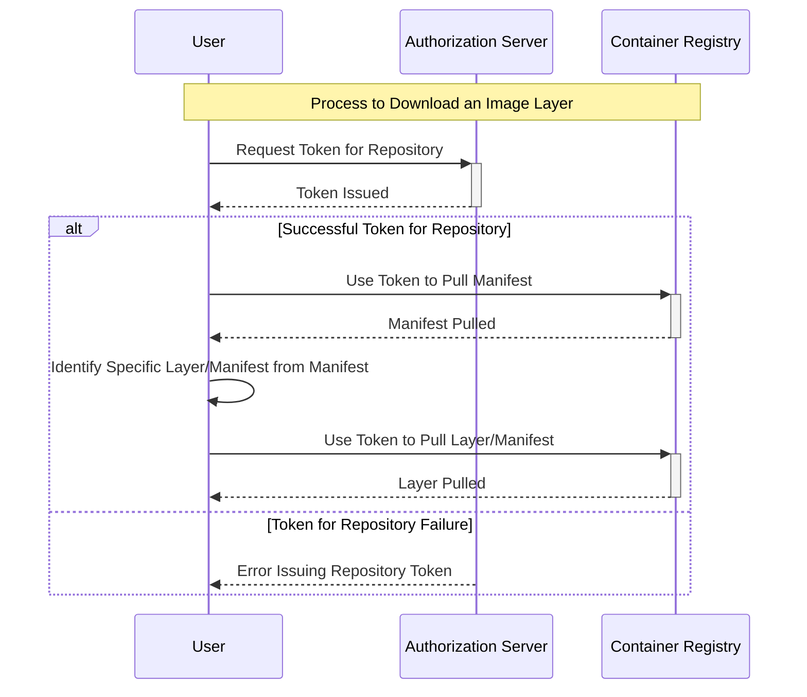

Cloud and Network Security Lab 4: Container Security
====

Responsible person/main contact: Niklas Saari

## Preliminary tasks & prerequisites

> The second part of the container security lecture *is directly related* to this exercise.

This week is all about containers, especially about how the Linux kernel works, Open Container Initiative (OCI) standards, and how to manage your dependencies.

So-called containers these days as we know them, are mostly based on OCI standards and Linux kernel user-space virtualisation. 


Check the OCI standards:
 * [Distribution Specification](https://github.com/opencontainers/distribution-spec)
 * [Image Specification](https://github.com/opencontainers/image-spec)
 * [Runtime Specification](https://github.com/opencontainers/runtime-spec)

Core concepts are also handled in lecture.

## Grading

>> [!Note]
>> You can get task 1 and task 2 automatically graded in Moodle. No need to return anything in GitHub for those, if you don't want to. If you think you did something correctly, but not getting the correct answer, you can return to GitHub to get partial grade.

<!-- <details><summary>Details</summary> -->

You are **not required** to do the tasks in order.

However, the difficulty and expected time consumption are linear, so you will probably get more points with less effort if you do the tasks in order.

Task #|Points|Description
-----|:---:|-----------
Task 1 | 1 | Leaking secrets in containers (Moodle exam) 
Task 2 | 1 | Privilege escalation on containers (Moodle exam)
Task 3 | 2 | Software Bill of Materials (SBOM) in containers 
Task 4 | 1 | Linux kernel security policies


You can acquire up to 5 points from the whole exercise.
<!-- </details> -->

---
## Task 1: Leaking secrets in containers

> [!Note]
> To complete this task, you need start the first Moodle exam. You will get a tag of OCI image in `ghcr.io` container registry. 
If you don't care about points, you can use `ghcr.io/ouspg/cans41:testimage` for learning.

You don't need to pull or run the containers with `docker` to complete this exercise. However, if you want to, provided container images have support for **both `linux/amd64` and `linux/arm64` architectures**.

When you pull the container image from the remote registry, there must be some sort of configuration and rules included on what the image uses by default when you run `docker run`. 
Docker also identifies the correct architecture for the image.

In this case, if you run the container as `docker run ghcr.io/ouspg/cans41:<tag>`, it just prints something like the following:
```text
       _,met$$$$$gg.          root@11017150e35b
    ,g$$$$$$$$$$$$$$$P.       -----------------
  ,g$$P"     """Y$$.".        OS: Debian GNU/Linux 12 (bookworm) aarch64
 ,$$P'              `$$$.     Host: QEMU Virtual Machine virt-8.2
',$$P       ,ggs.     `$$b:   Kernel: 6.7.5-200.fc39.aarch64
`d$$'     ,$P"'   .    $$$    Uptime: 1 day, 12 hours, 23 mins
 $$P      d$'     ,    $$P    Packages: 246 (dpkg)
 $$:      $$.   -    ,d$$'    Shell: bash 5.2.15
 $$;      Y$b._   _,d$P'      CPU: (2)
 Y$$.    `.`"Y$$$$P"'         Memory: 234MiB / 1950MiB
 `$$b      "-.__
  `Y$$
   `Y$$.
     `$$b.
       `Y$$b.
          `"Y$b._
              `"""
```


Also, when you build the container image from the `Containerfile`, there are many possibilities to define build arguments and environment variables for the resulting Linux environment. 

The containers also famously use layered filesystems to reduce the total disk space and network bandwidth usage, while also allowing to use of them as a base for creating new images.  

Almost everything previously mentioned is defined in the so-called *[manifest file](https://github.com/opencontainers/image-spec/blob/main/manifest.md)*.

From the manifest file, you see all the required layers to download and use for constructing the final image.
For example, the runtime configuration is stored in the containers' `config` layer.

The manifest file also defines the digests of other layers, which can be similarly used to download the other layers.
The config layer describes a bit what happens on other layers.

Check the following `Containerfile`, which is used to create the provided image:
```dockerfile
FROM debian:latest

ARG MY_SECRET

RUN apt-get update
RUN apt-get install -y neofetch

COPY secret.txt /root/secret.txt

RUN echo "$MY_SECRET"
RUN cat /root/secret.txt
RUN rm /root/secret.txt
RUN unset MY_SECRET

ENTRYPOINT ["/bin/sh", "-c" ]
CMD ["neofetch"]
```

You see that there are two different secrets are used. To complete this task, you need to find them both from the provided image.
Even if they are not visible when you run the container, it does not mean that they are not somewhere


Instead of using the `Docker` or `Podman` command-line tool to do this task, it is recommended to do it with a mix of `curl`, `tar` and `jq` tools instead.
We repeat the process that Docker does when it pulls the container image from the registry, sets the runtime configurations and retrieves the missing filesystem layers.

It will give you a clearer picture of how the OCI distribution and image specifications work together.

The process is as follows:

 * Get the authentication token for the remote registry, for GitHub the endpoint is `https://ghcr.io/token`. This is not defined in the OCI specifications but [in the open-source registry implementation](https://distribution.github.io/distribution/spec/auth/token/) of the OCI distribution specification.
 Remember the `scope` and `service` parameters.

 * Define the [`Accept` HTTP header](https://github.com/opencontainers/image-spec/blob/main/media-types.md) and get a specific manifest as defined in the [end-point list](https://github.com/opencontainers/distribution-spec/blob/main/spec.md#endpoints).
 * The manifest will describe the **identifier digest** for each downloadable part of the container image. Use the digest to download these `tar` blobs.


This will result in general for the simplified graph as follows:




> [!Note]
> Since the image has been built for multi-architecture, it uses also [index manifest](https://github.com/opencontainers/image-spec/blob/main/image-index.md). To get manifest for specific architecture, you need to acquire the index manifest first.


### Task 1A) Environment variables and container configuration (0.5p)


> Find the secret build-time variable and return it to Moodle exam to get it automatically reviewed. It should be in form `flag{hexstringj}`.

Note that both sections A and B are graded in the same field - the previous answer will get half of the points. Use syntax `flag{flagA} flag{flagB}` to get both graded and full points.

### Taks 1B) Finding the file with the secret (0.5p)


The previously created container image was created somewhat inefficiently - it used multiple `RUN` commands which will result in a new layer each time in the final image.
Additional layers can bring benefits with cache re-usage and therefore it can shorten repetitive build times, but sometimes there are risks included and not all additional layers are beneficial.

Not only does it increase disk space, but it also means that you might accidentally include secrets to your production image when you did not intend to do so if you don't understand how layers work.

To avoid this, you either use one `RUN` command to construct the whole image or combine all the layers into a single one. Or **even better**, just use the multi-stage builds.

To further inspect the layers and reproduce the previous, you can use the [dive](https://github.com/wagoodman/dive) tool.
There are many ways to find the layer, but extracting it directly from the registry gets us a better understanding of how containers internally work.


> Find the secret file content from the image layers and return it to the Moodle exam. Note order when returning both flags: A must be before B flag, and flags are separated with space.


## Task 2: Privilege escalation on containers (1p)

> This is a CTF style task. You will get an access token from the Moodle exam. Use that to access external service. It is possible that someone else uses the same instance, so try to not break things and maybe clean your possible mess afterwards. 

Assuming that the Linux kernel nor underlying hardware have vulnerabilities and you have attempted to build your container properly by adding a separate user to run the service, the most common attack vector to typically escape the container is the shared volume(s), which are incorrectly used.

Volumes are typically used to mount secrets, configuration files or object storages to the running container.

Sometimes, there might be other scenarios that need mounting.
What if you need to mount a file-based Application Programming Interface (API) end-point like a Docker socket? In Linux, everything is typically a file and the file can act as an interface.
This is typical in scenarios when you deploy a CI/CD pipeline runner in the cloud and the runner builds container images.

Sometimes it is more efficient to share the same Docker daemon that runs the runner as the runner uses to build the images.
However, if this is done incorrectly, ***this highlights a very specific risk that appears from volume mounting; it can be used as a route for privilege escalation***.

The docker daemon is running with root privileges; what if someone can control this daemon with lower privileges? A reminder that this is just a single example; any careless mounting can be dangerous.

All you need is: https://juggernaut-sec.com/docker-breakout-lpe/

For an extra level of fun, you can only use the `curl` command to succeed, but there are easier ways.

> You will be provided with a Jupyter Notebook instance, which has some volume mount and permission issues. Find the flag from the parent instance which runes the Jupyter Notebook.

Task 3: TBA

Task 4: TBA