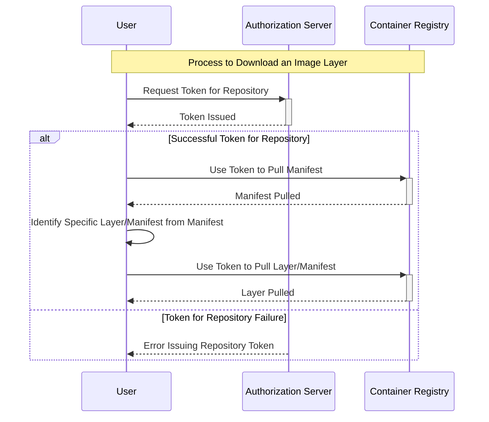

Cloud and Network Security Lab 4: Container Security
====

Responsible person/main contact: Niklas Saari

## Preliminary tasks & prerequisites

> The second part of the container security lecture *is directly related* to this exercise.

This week is all about containers, especially about how the Linux kernel works, Open Container Initiative (OCI) standards, and how to manage your dependencies.

So-called containers these days as we know them, are mostly based on OCI standards and Linux kernel user-space virtualisation. 


Check the OCI standards:
 * [Distribution Specification](https://github.com/opencontainers/distribution-spec)
 * [Image Specification](https://github.com/opencontainers/image-spec)
 * [Runtime Specification](https://github.com/opencontainers/runtime-spec)

Core concepts are also handled in lecture.

## Grading

> [!Note]
> You can get task 1 and task 2 automatically graded in Moodle. No need to return anything in GitHub for those, if you don't want to. If you think you did something correctly, but not getting the correct answer, you can return to GitHub to get partial grade.

<!-- <details><summary>Details</summary> -->

You are **not required** to do the tasks in order.

However, the difficulty and expected time consumption are linear, so you will probably get more points with less effort if you do the tasks in order.

Task #|Points|Description
-----|:---:|-----------
Task 1 | 1 | Leaking secrets in containers (Moodle exam) 
Task 2 | 1 | Privilege escalation on containers (Moodle exam)
Task 3 | 2+ | Software Bill of Materials (SBOM) in containers 
Task 4 | 1 | Linux kernel security policies


You can acquire up to 5 points from the whole exercise.
<!-- </details> -->

---
## Task 1: Leaking secrets in containers

> [!Note]
> To complete this task, you need start the first Moodle exam. You will get a tag of OCI image in `ghcr.io` container registry. 
If you don't care about points, you can use `ghcr.io/ouspg/cans41:testimage` for learning.

You don't need to pull or run the containers with `docker` to complete this exercise. However, if you want to, provided container images have support for **both `linux/amd64` and `linux/arm64` architectures**.

When you pull the container image from the remote registry, there must be some sort of configuration and rules included on what the image uses by default when you run `docker run`. 
Docker also identifies the correct architecture for the image.

In this case, if you run the container as `docker run ghcr.io/ouspg/cans41:<tag>`, it just prints something like the following:
```text
       _,met$$$$$gg.          root@11017150e35b
    ,g$$$$$$$$$$$$$$$P.       -----------------
  ,g$$P"     """Y$$.".        OS: Debian GNU/Linux 12 (bookworm) aarch64
 ,$$P'              `$$$.     Host: QEMU Virtual Machine virt-8.2
',$$P       ,ggs.     `$$b:   Kernel: 6.7.5-200.fc39.aarch64
`d$$'     ,$P"'   .    $$$    Uptime: 1 day, 12 hours, 23 mins
 $$P      d$'     ,    $$P    Packages: 246 (dpkg)
 $$:      $$.   -    ,d$$'    Shell: bash 5.2.15
 $$;      Y$b._   _,d$P'      CPU: (2)
 Y$$.    `.`"Y$$$$P"'         Memory: 234MiB / 1950MiB
 `$$b      "-.__
  `Y$$
   `Y$$.
     `$$b.
       `Y$$b.
          `"Y$b._
              `"""
```


Also, when you build the container image from the `Containerfile`, there are many possibilities to define build arguments and environment variables for the resulting Linux environment. 

The containers also famously use layered filesystems to reduce the total disk space and network bandwidth usage, while also allowing to use of them as a base for creating new images.  

Almost everything previously mentioned is defined in the so-called *[manifest file](https://github.com/opencontainers/image-spec/blob/main/manifest.md)*.

From the manifest file, you see all the required layers to download and use for constructing the final image.
For example, the runtime configuration is stored in the containers' `config` layer.

The manifest file also defines the digests of other layers, which can be similarly used to download the other layers.
The config layer describes a bit what happens on other layers.

Check the following `Containerfile`, which is used to create the provided image:
```dockerfile
FROM debian:latest

ARG MY_SECRET

RUN apt-get update
RUN apt-get install -y neofetch

COPY secret.txt /root/secret.txt

RUN echo "$MY_SECRET"
RUN cat /root/secret.txt
RUN rm /root/secret.txt
RUN unset MY_SECRET

ENTRYPOINT ["/bin/sh", "-c" ]
CMD ["neofetch"]
```

You see that two different secrets are used. To complete this task, you need to find them both from the provided image.
Even if they are not visible when you run the container, it does not mean that they are not somewhere.


Instead of using the `Docker` or `Podman` command-line tool to do this task, it is recommended to do it with a mix of `curl`, `tar` and `jq` tools instead.
We repeat the process that Docker does when it pulls the container image from the registry, sets the runtime configurations and retrieves the missing filesystem layers.

It will give you a clearer picture of how the OCI distribution and image specifications work together.

The process is as follows:

 * Get the authentication token for the remote registry, for GitHub the endpoint is `https://ghcr.io/token`. This is not defined in the OCI specifications but [in the open-source registry implementation](https://distribution.github.io/distribution/spec/auth/token/) of the OCI distribution specification.
 Remember the `scope` and `service` parameters.

 * Define the [`Accept` HTTP header](https://github.com/opencontainers/image-spec/blob/main/media-types.md) and get a specific manifest as defined in the [end-point list](https://github.com/opencontainers/distribution-spec/blob/main/spec.md#endpoints).
 * The manifest will describe the **identifier digest** for each downloadable part of the container image. Use the digest to download these `tar` blobs.


This will result in general for the simplified graph as follows:




> [!Note]
> Since the image has been built for multi-architecture, it uses also [index manifest](https://github.com/opencontainers/image-spec/blob/main/image-index.md). To get manifest for specific architecture, you need to acquire the index manifest first.


### Task 1A) Environment variables and container configuration (0.5p)


> Find the secret build-time variable and return it to Moodle exam to get it automatically reviewed. It should be in form `flag{hexstring}`.

Note that both sections A and B are graded in the same field - the previous answer will get half of the points. Use syntax `flag{flagA} flag{flagB}` to get both graded and full points.

### Taks 1B) Finding the file with the secret (0.5p)


The previously created container image was created somewhat inefficiently - it used multiple `RUN` commands which will result in a new layer each time in the final image.
Additional layers can bring benefits with cache re-usage and therefore it can shorten repetitive build times, but sometimes there are risks included and not all additional layers are beneficial.

Not only does it increase disk space, but it also means that you might accidentally include secrets to your production image when you did not intend to do so if you don't understand how layers work.

To avoid this, you either use one `RUN` command to construct the whole image or combine all the layers into a single one. Or **even better**, just use the multi-stage builds.

To further inspect the layers and reproduce the previous, you can use the [dive](https://github.com/wagoodman/dive) tool.
There are many ways to find the layer, but extracting it directly from the registry gets us a better understanding of how containers internally work.


> Find the secret file content from the image layers and return it to the Moodle exam. Note order when returning both flags: A must be before B flag, and flags are separated with space.


## Task 2: Privilege escalation on containers (1p)

> This is a CTF style task. You will get an access token from the Moodle exam. Use that to access external service. It is possible that someone else uses the same instance, so try to not break things and maybe clean your possible mess afterwards. 

Assuming that the Linux kernel nor underlying hardware have vulnerabilities and you have attempted to build your container properly by adding a separate user to run the service, the most common attack vector to typically escape the container is the shared volume(s), which are incorrectly used.

Volumes are typically used to mount secrets, configuration files or object storages to the running container.

Sometimes, there might be other scenarios that need mounting.
What if you need to mount a file-based Application Programming Interface (API) end-point like a Docker socket? In Linux, everything is typically a file and the file can act as an interface.
This is typical in scenarios when you deploy a CI/CD pipeline runner in the cloud and the runner builds container images.

Sometimes it is more efficient to share the same Docker daemon that runs the runner as the runner uses to build the images.
However, if this is done incorrectly, ***this highlights a very specific risk that appears from volume mounting; it can be used as a route for privilege escalation***.

The docker daemon is running with root privileges; what if someone can control this daemon with lower privileges? A reminder that this is just a single example; any careless mounting can be dangerous.

All you need is: https://juggernaut-sec.com/docker-breakout-lpe/

For an extra level of fun, you can just use the `curl` command to succeed.
When operating with `curl`, [the Docker Engine API](https://docs.docker.com/engine/api/v1.45/) reference might be useful.

> You will be provided with a Jupyter Notebook instance, which has some volume mount and permission issues. Find the flag from the parent instance which runs the Jupyter Notebook.


## Task 3: Sofware Bill of Materials (SBOM) in containers (2p)

[A “software bill of materials” (SBOM)](https://www.cisa.gov/sbom) is used as a key building block in software security and software supply chain risk management.
In cloud-native environments, different parties are responsible for different parts. 
We do not touch hardware-related aspects in this course, but rather the software parts that you might end up needing to note when deploying software into cloud-native platforms.

In cloud-native environments, you end up using the idea of [Infrastructure as Code (IaC)](https://en.wikipedia.org/wiki/Infrastructure_as_code) quite often. 
In previous weeks, you have got a taste of it with Terraform, and now with containers.
Someone has the responsibility to be aware of the whole software stack and note risks that dependencies and the overall software supply chain can bring.


### Task 3A) Getting the bill of materials (0.25p)

To demonstrate the automated scanning of getting the catalog of the software, we try out [the Syft tool](https://github.com/anchore/syft).
It supports a wide variety of different Linux distributions and programming languages.

Make a simple test for a container image `docker.io/library/debian:latest`.

> Include the command and output.
> Do you think that this catalog efficiently includes all the software from the container? Explain how it likely identifies the software and the version numbers in this case.

### Task 3B) Getting the CVEs (0.25p)

Now, use the [Grype](https://github.com/anchore/grype) tool to compare the extracted SBOM to the CVE database.

> Include the command and the output. What it means when there is "(won't fix)" comment for the package? Is it hard to tell what vulneralibities might be relevant for you if you publish your service, for example, by using the Debian distribution? Also note that this was the latest possible Debian image.

### Task 3C) Building more compact containers (1.5p)

We can conclude, that irrelevant dependencies at least bring additional noise, on top of the extended attack surface.
By making a minimal container image, it improves *the signal-to-noise ratio*.
The usage of minimal dependencies does not prevent the problems of required, direct dependencies, but it can make exploiting scenarios much harder.

Let's try out [a multi-stage build](https://docs.docker.com/build/building/multi-stage/) (build, runtime stages) for a container, with minimal user permissions for production, to create a container image.
The image should use a separate user with minimal permissions for its intended purpose. The workflow is as follows:
  * Let's build [cURL](https://curl.se/) CLI from the source as an example which also needs TLS CA certificates and other dependencies.
  * From the [git](https://github.com/curl/curl), check also [GIT_INFO](https://github.com/curl/curl/blob/master/GIT-INFO.md)
  * You need to figure out the build-time and runtime dependencies
  * Build cURL on a separate stage and copy the build results to further stages.

Make a comparison of the CVE lists with `grype` (does it identify the packages and what is the noise level) and explore the image sizes and efficiency with the [`dive`](https://github.com/wagoodman/dive) tool. 
 * Analyse at first the scenario if you would use cURL in its build environment. You can try to remove manually unneeded dependencies and clean package caches etc.
 * Then introduce an additional runtime stage with runtime dependencies only, and explore the differences between different runtime images, when you manage to build a working cURL CLI application:
   * [Debian](https://hub.docker.com/_/debian)
   * Debian-slim
   * [Alpine](https://hub.docker.com/_/alpine/) (You need to build cURL differently for the [musl library](https://musl.libc.org/), possibly use Alpine as the build image as well) 
   * Google's [distroless](https://github.com/GoogleContainerTools/distroless) images. If you do this step correctly, the resulting image with a functional `curl` command with TLS support and default build arguments should be only around 20 megabytes. Also, check the full catalog with `syft` here!
   * *Finally*, make a static build of cURL without any dynamic dependencies, and adjust the base image runtime dependencies accordingly. Static build means here that you embed `libcurl`, `libc`, `libssl` and other dependencies into a single binary file. You can find plenty of examples on the internet. If you did this correctly, the resulting image size should be around 7 megabytes on quite minimal configurations.

The `:debug` tag of the distroless images is useful if you are missing some libraries that you need to dynamically link, but you don't know if they are misplaced or not included at all.

Make always sure that `curl` indeed works and can form TLS connections into some websites.
We don't care if the compression or extra protocols are not supported.

When you make a statically linked build, the `syft` tool should output something like following:
```sh
└:: » syft curltest
 ✔ Loaded image                                                                                                                                                                      curltest:latest
 ✔ Parsed image                                                                                                              sha256:ce8beceb4046091be4acf9e11b471215f8968762971c6a39033cceb4af67669e
 ✔ Cataloged contents                                                                                                               6bd7c1130c9652ae05983d169f7c3b948fa29de98db8590a790bca036ed6a55b
   ├── ✔ Packages                        [3 packages]
   ├── ✔ File digests                    [1,382 files]
   ├── ✔ File metadata                   [1,382 locations]
   └── ✔ Executables                     [1 executables]
NAME        VERSION          TYPE
base-files  11.1+deb11u9     deb
netbase     6.3              deb
tzdata      2024a-0+deb11u1  deb
```


> On top of making the analysis based on different runtime environments, answer the following questions.

#### Q1: Do you think all the dependencies were correctly identified and the scanner finds versions correctly? Which runtime environment was "the best"?

#### Q2: Consider the pros and cons of debugging capabilities versus improved security and efficiency, when using minimal container images.
Are the decent debugging capabilities to use minimal containers regardless? Think about the use case of the following:
  * Just copying the BusyBox into the container
  * Using a side-car container (a container that shares resources like network and disk, etc. with another container, making it possible to inspect another container without altering it )
  * Ignore the security and efficiency and just use full-blown distribution for the best UX. Security is too hard.

#### Q3: Would the extra complexity and more difficult debugging prevent the adaption of container optimisation? Especially, if your container includes very complex software with many dependencies.

#### Q4: What are the downsides of using statically built runtime dependencies in terms of CVE discoverability? What is a software composition analysis?

> [!Important]
> Remember to return all the Containerfiles or a single Containerfile with comments of alternative builds! Analysis about the different builds is important.


### Task 3D) From scratch and reproducible (1p bonus or alternative for the final task)

> ![Warning]
> Nix uses a bit complicated concepts, so this might a bit harder task and mostly intended as bonus task. Task is mostly reference to as "good to know".

Making minimal or reproducible container images without specific package managers or build systems (such as [Bazel](https://github.com/bazelbuild/bazel) or [Earthly](https://github.com/earthly/earthly)) is a very difficult and unstable process when the application gets more complex.

Traditional OCI container builders will likely get a high competition from transactional or functional package managers-based builders in the future.
At first, they will likely start to replace some containers as development environments.

There is still some work to do to solve the UX problems and in that way increase the popularity.


Check the description of how functional package managers work and the potential benefits from [Nix's documentation.](https://nixos.org/guides/how-nix-works/) 

The science behind them is much stronger, for example, what current "de facto" docker builders have, to make more reliable, fully reproducible and efficient packages.
If you want to see the science, see the PhD about [Nix](https://edolstra.github.io/pubs/phd-thesis.pdf).

The science itself needs reproducibility, and complex reproducible computational environments have been demonstrated with [Guix](https://hpc.guix.info/blog/2019/10/towards-reproducible-jupyter-notebooks/), for example.

Particularly, [reproducible builds](https://en.wikipedia.org/wiki/Reproducible_builds) are used to create a so-called **chain of trust**, on top of other benefits such as the reproducibility of evidence of something.
More information is also [here.](https://reproducible-builds.org/)

Let's say your application is open-source: how can you make it possible for end users to verify that the shipped production build matches the open-source version, the code they can see and observe? Or that nobody has compromised the build process? You can make fully reproducible builds!

You can verify that the open-source service you rely on is running as it is described based on its source repository; verified reproducible builds provide a strong countermeasure against attacks where binaries do not match their source code.


Let's try out to make a fully reproducible container, with only minimal dependencies.
This is not guaranteed with basic container builders - instead, we need to use more complex tools.

You can choose one software application that you would build as a container by using [Nix.](https://nix.dev/tutorials/nixos/building-and-running-docker-images.html)
See the additional documentation [here.](https://nixos.org/manual/nixpkgs/stable/#sec-pkgs-dockerTools)
The container should follow at least the following idea:
 * Non-root user
 * All the dependencies on separate layers by using nix-store
 * No static linking (`libc`, `libssl` et. all as dynamic, replaceable libraries on layers) for efficiency.
 * For example, `syft` tool should work on analysing the SBOM.
 * Remember, that in Linux everything is just a file!


A good blog post and talk about the use of Nix for building containers is available [here.](https://xeiaso.net/talks/2024/nix-docker-build/) You can find many other blogs as well.

Things can get soon complicated, for example, check the official `curl` package build configuration for [Nix](https://github.com/NixOS/nixpkgs/blob/master/pkgs/tools/networking/curl/default.nix).

> Build Container image with a Nix and demonstrate that it works. Try to build it so, that each dependency is it's in own layer. Include the modified file and all the necessary commands you needed to build the image. Hopefully, you do a bit more compelex software than 'Hello, world!' example - this affects grading.


If you want, you can also use [`Guix`](https://guix.gnu.org/manual/en/html_node/Invoking-guix-pack.html) to build the image or the previously mentioned Bazel or Earthly, or some other reproducible build system to create OCI image.
For example, Google's distroless container images are built with [Bazel](https://github.com/bazel-contrib/rules_oci).


### More

For example, the popular messaging application Signal has fully reproducible builds on [Android](https://github.com/signalapp/Signal-Android/tree/main/reproducible-builds).


## Task 4: Linux Kernel Security Policies (1p):

The principle of least privilege is a core concept in cyber security.
This is especially important when deploying services, as it provides additional isolation and prevents lateral movement in case our own software or its dependencies have vulnerabilities

Typically, the above principle is enforced with mandatory access control (MAC) systems in Linux.
Traditional Discretionary Access Control (DAC) has limitations in some cases, as the access control depends only on the owner or the group of the file.
For example, consider a case where a privilege escalation vulnerability or misconfiguration allows an attacker to change the ownership of critical files.
In such scenarios, MAC systems can provide an additional layer of protection by enforcing access controls on a per-process basis, even if file ownership or permissions are compromised.

Isolation and security of modern containers are based on the features of the underlying Linux kernel.

In containers, there are mainly adapted by:
  
  * With chroot, namespaces and cgroups
  * Kernel [capabilities](https://man7.org/linux/man-pages/man7/capabilities.7.html)
  * [Security Enhanced Linux (SELinux)](https://en.wikipedia.org/wiki/Security-Enhanced_Linux) - label-based Kernel security module for MAC
  * [AppArmor](https://apparmor.net/) as user-friendly MAC, see relevant [Wiki page](https://gitlab.com/apparmor/apparmor/-/wikis/home)
  * [Secure computing mode (seccomp)](https://docs.docker.com/engine/security/seccomp/) - Linux Kernel feature to limit system calls

SELinux and AppArmor share a similar use case, while AppArmor is more user-friendly, but offers fewer configuration possibilities.
On this task, we use AppArmor instead of SELinux.

> [!Note]
> To be able to do this task, your Linux machine must have AppArmor enabled.

### Task 4A) Identify default AppArmor and Seccomp profiles (0.25p)


When you use Docker, and you run the container as a `root` user, there must be some way of isolating this user from the host system's root user.
The UID in the container is typically the same for the root as in the host system, so how does this isolation happen?

By default, Docker limits access to all host devices with [cgroups](https://www.kernel.org/doc/Documentation/cgroup-v1/devices.txt).

Internally, this is often done by the container runner, which in Docker is [`containerd` by default](https://www.docker.com/blog/containerd-vs-docker/).

Additionally, Docker (and other container runners), enforce specific AppArmor and Seccomp profiles.

> Find out what the default AppArmor profile does in the Docker and what is the default Seccomp profile. Briefly describe their contents and purposes. You can also include links to these templates. Also describe, how you can read AppArmor logs.

### Task 4B) Hardening the vulnerable app (0.75p)

We have the following Go application in [pingservice](pingservice) directory which provides a ping command as a web page service.
However, the application has **a command injection vulnerability**.

Navigate to [pingservice](pingservice) directory and build the image as

```bash
docker build -t pingservice .
```
And run, as
```
docker run --name pingservice --rm -p 8000:80 pingservice
```

The service can be found at http://localhost:8000/


The container runs as a root user and with the command injection, you can do basically anything malicious on the current container with the current setup.


Your work is as follows. Document the process:

* Find out the minimal amount of allowed kernel capabilities so that the web server and ping command still work
* Create and apply an AppArmor policy that the service can only use a ping command as it currently does and read files only in the `/root/` directory. Writing is not allowed.
* Create and apply a minimal Seccomp profile so that the web server and ping command still work
* Add `cgroup` limitations so that this service cannot consume all the resources of the machine (e.g. reduce the impact of DDoS )
* Demonstrate the functionality (inaccessibility) as the root user.
* Think about the effect of isolation if you just create a normal user and run the process on this user's owning directory and the user's namespace. You can also think about other scenarios than just this application.
* Think about the maintainability aspects of managing capabilities, AppArmor profiles, and Seccomp profiles in a real-world scenario. This can be the main reason not to use these features. Are there known performance issues with AppArmor and Seccomp policies?

If you manage to use the previous runtime policies correctly, even if a root user is running with arbitrary command execution permissions, it cannot do anything damaging in this scenario. 

However, sometimes on more complex systems everything cannot be avoided, but certainly, a lot can be mitigated.


#### Additional material

* [An Introduction to Linux Capabilities](https://earthly.dev/blog/intro-to-linux-capabilities/)
* [Docker Security Cheat Sheet](https://cheatsheetseries.owasp.org/cheatsheets/Docker_Security_Cheat_Sheet.html)